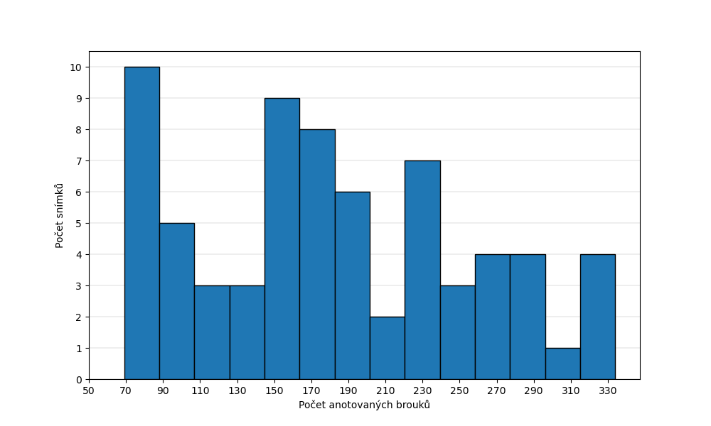
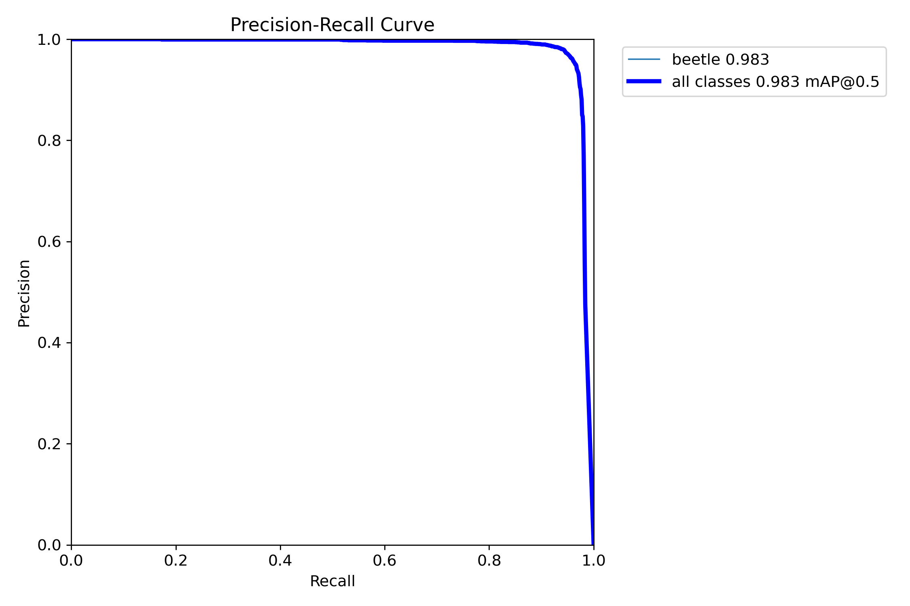
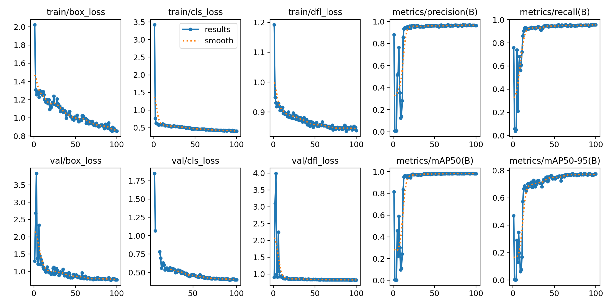

# KNN - Beetle tracking

#### Authors:
- Dalibor Kříčka (xkrick01)
- Jakub Pekárek (xpekar19)
- Pavel Osinek (xosine00)
#### 2025, Brno

---
Datasets and trained detection YOLO11 models: [Goole Drive](https://drive.google.com/drive/folders/1V0BysvBJw6q5AnPVqnRvZqehCqD-J6dl?usp=sharing)&nbsp;&nbsp;(Log in with a BUT Google account required)

An Example of beetle tracking in video using a finetuned YOLO11 detection model and BoT-Sort tracker:

https://github.com/user-attachments/assets/31f11c55-6472-4667-9631-df69a651704d

---

## **Task Description**
This project aims to develop a tool for tracking beetles in video recordings (several minutes long). The outcome should be the recorded paths of individual beetles, i.e., their movement across the scene during the recording. The relevant problems for this project are:

- Data annotation – creation of a custom dataset;
- Object detection – fine-tuning a pre-trained [YOLO11m model](https://docs.ultralytics.com/);
- Multi-Object Tracking (MOT) – utilizing the [BoT-Sort algorithm](https://github.com/NirAharon/BoT-SORT).

The input is a video recording with a resolution of 1920 × 1304 and a frame rate of 15 FPS, and the output is machine-processable output with individual beetle tracks (for example json).

## **Dataset**
For a more time-efficient dataset creation, a simple method of recognizing dark objects on a light background was initially used in the first phase, utilizing thresholding in grayscale and contour detection with OpenCV. This allowed for the automatic annotation of part of the individuals in the space while the remaining objects were annotated manually.
In the second phase, the pre-trained YOLO model was used for automatic annotation with the original smaller dataset. The result was that a significant portion of the objects were labeled, reducing the amount of manual work and enabling adding a larger number of annotated frames to the dataset (a certain form of the Active Learning method).

Dataset information:
- _Data source:_ 8 video recordings of 1000 frames each, with varying beetle density per frame (see OneDrive);
- _Storage with individual versions of the datasets_ (higher number = newer) – [Google Drive](https://drive.google.com/drive/folders/1V0BysvBJw6q5AnPVqnRvZqehCqD-J6dl?usp=sharing) (you need to be logged in with a BUT Google account);
- _Number of annotated frames_ –
    - Training set: 79 (number of objects: 14,319)
    - Validation set: 20 (number of objects: 3,357)
- _Total number of annotated objects_: 17,676;
- _Average number of objects per frame_: 178.54;
- _Minimum number of objects per frame_: 63;
- _Maximum number of objects per frame_: 334;
- _Image resolution_: 640 × 640;
- _Dataset and annotation file format_: Ultralytics YOLO format;
- Histogram of the number of annotated beetles per frame, see image 1.

> **Img. 1:** Histogram of the number of annotated beetles per frame.

## **Evaluation**
### YOLO11
The evaluation is performed by comparing the metrics of the fine-tuned models. The best fine-tuned model so far has the following metrics:

- **AP@0.5 = 0.983**
    - Area under the PR curve, see Image 2;
- **Recall = 0.957**
    - The proportion of beetles that were correctly identified out of all the beetles present in the image;
    - $recall = \frac{TP}{TP+FN}\quad$
- **Precision = 0.965**
    - The proportion of correctly identified beetles out of all the objects detected. Formula.
    - $precision = \frac{TP}{TP+FP}$

where:
- TP - True positives,
- FP - False positives,
- TN - True negatives,
- FN - False negatives

> **Img. 2:** Precision-Recall Curve.

The goal is to maximize these metrics towards a value of 1. The progression of the metric values and loss functions during training can be observed in Image 3.

> **Img. 3:** Metric values and loss functions during training.

### BoT-Sort
As part of the current solution to the project, the metrics (such as MOTA, IDF1, ...) for object tracking have not yet been evaluated. The reason is the necessity to create ground truth, which involves labeling all animals in the sequence of frames (several hundred due to the slow movement of the beetles) and simultaneously maintaining their unique identifier across all frames. We have not yet found an effective way to solve this problem, and it is a subject for further consultation.

The preliminary results of the tracking are the recorded paths of individual beetles using the model we fine-tuned for detection (see the video above).

## **Baseline Solution**
The best model mentioned in the _Evaluation section_ was fine-tuned from the pre-trained YOLO11m model.

The parameters used for fine-tuning were:
- The image size was set to 640;
- The number of epochs was kept at 100. According to the output graphs (Figure 4), it might be possible to reduce the number of epochs and still achieve similar results;
- The batch size was set to 8 due to memory constraints;
- The dataset chosen was `Dataset7`, see the _Dataset chapter_.